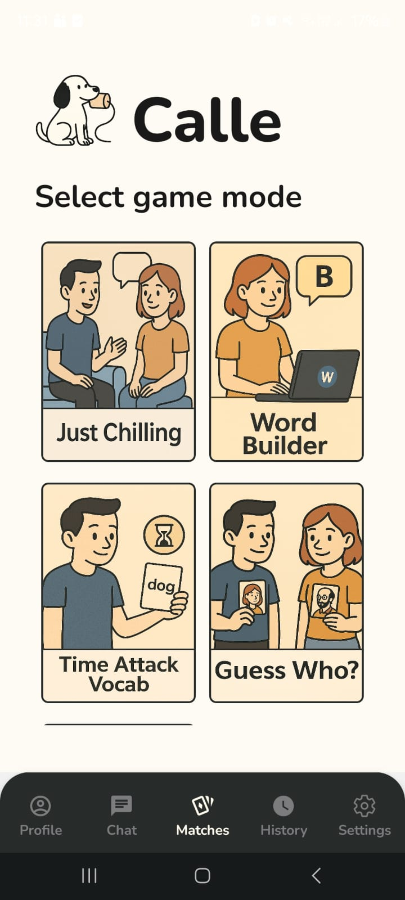
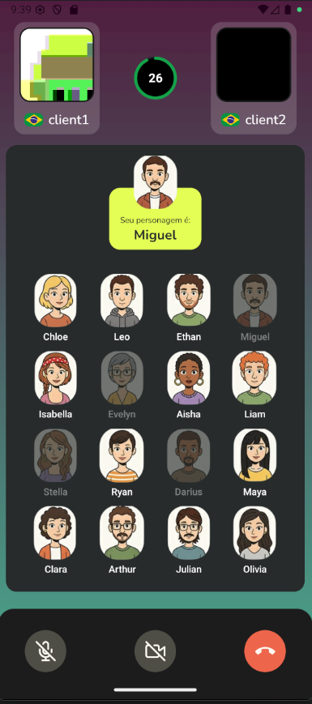
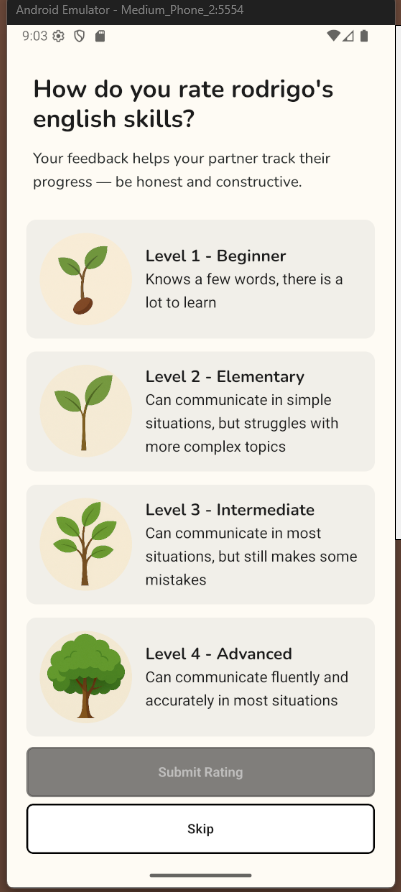
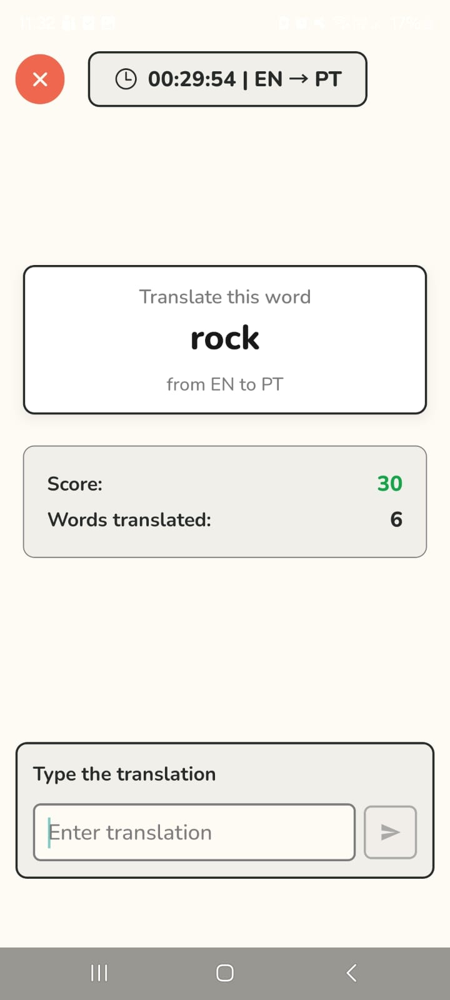

# Calle — Conversational Language Practice Mobile System

## Project summary
Calle is a mobile system designed to foster oral language practice through video-mediated games. Traditional language learning apps frequently emphasize passive skills (reading and grammar) while under-serving active spoken production—essential for communicative fluency. Calle aims to fill this gap by offering playful, social, and interactive contexts where users practice speaking in realistic scenarios.

Key aspects:
- Peer-to-peer video calls powered by WebRTC to enable low-cost, scalable real-time interactions.
- Matchmaking and game modes focused on conversational practice.
- Features: authentication, user profiles, automated pairing, chat, match history, and multiple game modes.
- Stack: React Native (mobile), NestJS (backend), PostgreSQL (database), WebRTC (video), WebSockets (real time communication)
- Development followed agile practices (Scrum/Kanban), with user stories, prototypes, UML diagrams and incremental sprints.

## Screenshots
Add screenshots or short GIFs showing the app running here.

## Features
- Real-time video chat (peer-to-peer)
- Matchmaking for multiple game modes (solo/duo)
- Typed and voice input modes for vocabulary games
- Profile customization and language fluency settings
- Match history and rating

## Technology stack
- Mobile: React Native / Expo
- Backend: NestJS
- Database: PostgreSQL
- Real-time: WebRTC + WebSocket signaling
- Other: TypeScript, React Query, Jest (tests)

## Getting started

Prerequisites:
- Node.js (16+)
- npm or yarn
- Docker (recommended for Postgres)
- For mobile: Expo CLI or React Native CLI (depending on workflow)

Recommended quick start (development with Docker):
1. Start services:
   - docker-compose (development):  
     docker-compose -f docker-compose.dev.yaml up --build

2. Backend:
   - cd backend
   - npm install
   - npm run start:dev
   - The backend config is driven by environment variables (see backend/.env).

3. Mobile (Expo Bare Workflow):
   - cd mobile
   - npm install
   - npx react-native start
   - Android: npx react-native run-android --device <deviceId>
   - The mobile config is driven by environment variables (see mobile/.env).

## Running tests
- Backend unit tests:  
  cd backend && npm run test
- Mobile unit tests (Jest):  
  cd mobile && npm run test
